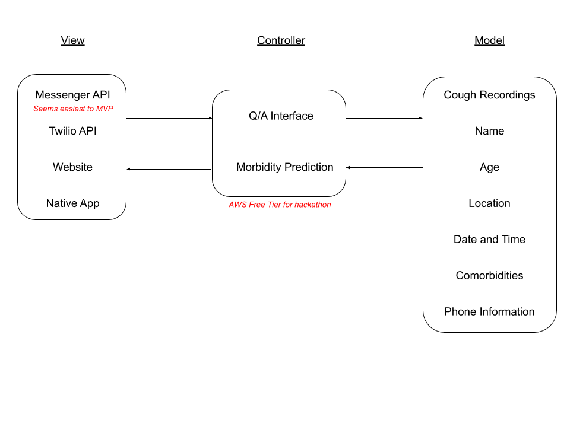

# covid-cough-prediction

The initial design diagram for this project is below.

## Resources

- [Open Science Framework sickness sounds dataset](https://osf.io/4pt2s/)
- [How to Send and Receive WhatsApp Media Messages Using Twilio (YouTube)](https://www.youtube.com/watch?v=fKi4oXu6lsI)
- [Reading input sound signal using Python](https://stackoverflow.com/questions/35344649/reading-input-sound-signal-using-python)
- [Capturing Voice Input in a Browser and Sending it to Amazon Lex](https://aws.amazon.com/blogs/machine-learning/capturing-voice-input-in-a-browser/)

## Collaborators

- [Poornachandra Kashi](https://github.com/poornachandrakashi)

This project is for the [MIT Covid-19 Hackathon](https://covid19challenge.mit.edu/)
